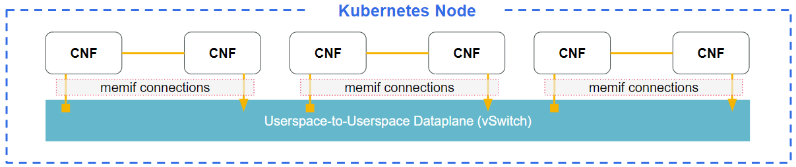

## Install Pipeline Service Chain Example (3 chains of 2 nodes)

This example installs the pipeline service chain example on a kubernetes worker node. All nodes are connected using Memif interfaces, with the chain endpoints connecting to the host vSwitch (VPP) while the intermediate connections are done directly between nodes.



### Prerequisites
A Kubernetes deployment with a host vSwitch (VPP) must be deployed prior to installing this example. Guides for setting this up can be found here:
* [Provision HW and deploy CNF Testbed Kubernetes cluster](/docs/Deploy_cnf_testbed_k8s.md)
* [Deploy vSwitch (VPP) in CNF Testbed Kubernetes cluster](/docs/Deploy_vswitch_cnf_testbed.md)

You should have a `kubeconfig` file ready on the machine, as it is used to deploy the example on a worker node.

Helm must be installed prior to installing this example. The steps listed below are based on [https://helm.sh/docs/intro/install/](https://helm.sh/docs/intro/install/)
```
$ curl -fsSL -o get_helm.sh https://raw.githubusercontent.com/helm/helm/master/scripts/get-helm-3
$ chmod 700 get_helm.sh
$ ./get_helm.sh
```

You will also need to configure a packet generator to test the example. Steps for doing this can be found in [Deploy Packet Generator](/docs/Deploy_pktgen_cnf_testbed.md). Be sure to note down the MAC addresses of the ports as mentioned in the section, as these will be needed prior to deploying the example.

**Preparing the K8s worker node**

By default the vSwitch (VPP) is configured for this (3c2n-csp) example use case. If a different configuration has been applied, SSH to the worker node and replace the vSwitch configuration as shown below:
```
$ cp /etc/vpp/templates/3c2n-csp.gate /etc/vpp/setup.gate
```

Once that has been done, restart the vSwitch using the below step (depending on how the vSwitch is deployed):
```
## vSwitch running in host
$ service vpp restart

## vSwitch running in container
$ docker restart vppcontainer
```

### Installing the Pipeline service chain example

Start by modifying the first line in [csp/values.yaml](./csp/values.yaml) to include the MAC addresses of the packet generator that were collected as part of the prerequisites. Once that is done, install the example by running the below commands from this directory:
```
## set environment variable for KUBECONFIG (replace path to match your location)
$ export KUBECONFIG=<path>/<to>/kubeconfig
$ helm install csp ./csp/
```

### Testing the Pipeline service chain example

Follow the steps listed in [Deploy Packet Generator](/docs/Deploy_pktgen_cnf_testbed.md). The packet generator should already be configured to work with this example use case.

