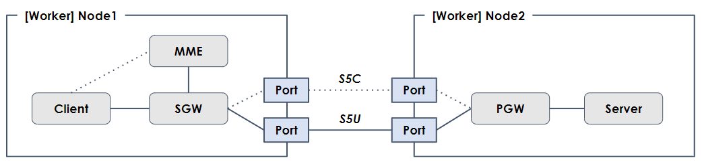

## Deploy multi-node GoGTP example with Multus on Kubernetes

This example use-case deploys the GoGTP service chain with Multus support on Kubernetes. This is a multi-node version of the use-case, that deploys the service chain across two worker nodes. The example includes two endpoints ("User Equipment" and "External Server") that can be used to test traffic through the GoGTP EPC implementation.



### Prerequisites
A Kubernetes cluster must be available prior to running this example. The cluster must be configured with Multus to provide additional interfaces to the pods in the service chain. Steps for setting up a cluster can be found [here](https://github.com/cncf/cnf-testbed/blob/master/tools/README.md).

***NOTE: This example requires two worker nodes, and at this time only supports the n2.xlarge.x86 servers***

### Configuring worker nodes
Before the service chain can be installed, the worker nodes will need to be pre-configured for connectivity between nodes to work as expected. You will need an ansible environment to do this, and steps to deploy this can be found [here](https://github.com/cncf/cnf-testbed/blob/master/docs/Deploy_K8s_CNF_Testbed.md#deploy-ansible-environment).

Once deployed, follow the below steps to configure the worker nodes:
```
$ export PROJECT_NAME="<Packet_project_name>"
$ export PACKET_FACILITY=<Facility, e.g. ewr1>
$ export DEPLOY_ENV=<Environment name, e.g. multbr>
$ export PACKET_API_TOKEN=<Packet_API_token>
  - This should already be set when deploying the ansible environment
  
$ ansible-playbook -i "<Worker_IP #1>,<Worker_IP #2>," k8s_worker_gogtp_quad_intel.yml
```

Once finished you can verify that VLANs have been added to the worker nodes. You can also check that bridges have been created on both worker nodes using `$ brctl show`.

### Installing the GoGTP service chain
The service chain is deployed using Helm. You will need to point the `KUBECONFIG` environment variable to your Kubeconfig file prior to running Helm. The steps can be seen below:
```
## set environment variable for KUBECONFIG (replace path to match your location)
$ export KUBECONFIG=<path>/<to>/kubeconfig

## Configure the bridges to be used with Multus to connect the pods
$ kubectl apply -f gogtp-bridges.yml

## Install the service chain
$ helm install ./gogtp/
```

Wait for approximately 30 seconds before checking that the eNB is running:
```
$ kubectl logs gogtp-enb
net.ipv4.ip_forward = 1 
[eNB] 2020/01/31 13:23:46 Established S1-MME connection with 172.21.1.12:36412
[eNB] 2020/01/31 13:23:46 Started serving S1-U on 172.21.0.11:2152
[eNB] 2020/01/31 13:23:46 Successfully established tunnel for 001010000000001
```

You should see output similar to what is shown below. If the log is empty wait a few more seconds and try again.

### Testing the GoGTP service chain
You can test the service chain by connecting from the "User Equipment" to the "External Server" using `wget`:
```
$ kubectl exec -it gogtp-ue /bin/bash
$$ wget http://10.0.1.201
```

You should see a successful HTTP request, followed by `index.html` being saved. You can also test the connection using `ping`:
```
$ kubectl exec -it gogtp-ue /bin/bash
$$ ping 10.0.1.201
PING 10.0.1.201 (10.0.1.201) 56(84) bytes of data. 
64 bytes from 10.0.1.201: icmp_seq=1 ttl=61 time=0.139 ms
64 bytes from 10.0.1.201: icmp_seq=2 ttl=61 time=0.126 ms
...
```

### Remove the GoGTP service chain and network bridges
Remove the GoGTP deployment using helm, and the network bridges using `kubectl` as shown below:
```
$ helm delete $(helm list | grep gogtp-0.1.0 | awk '{print $1}')
$ kubectl delete -f gogtp-briges.yml
```

